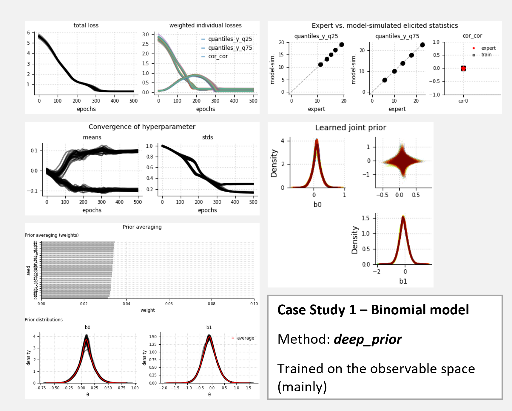
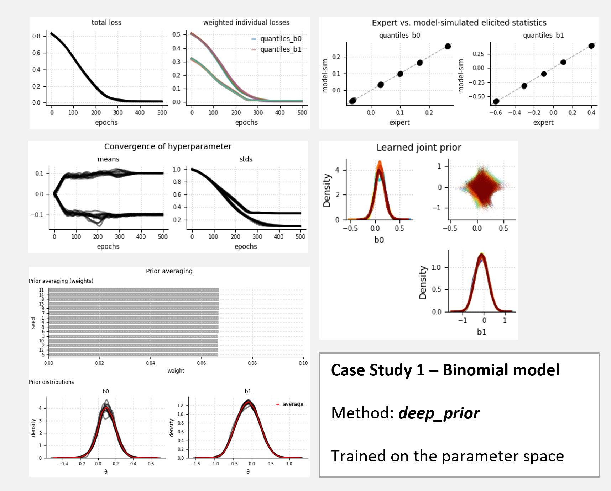
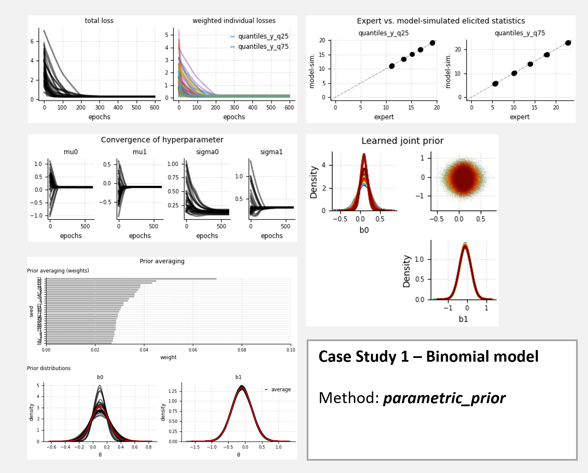

# Supplementary material for the binomial model (Case Study 1)

## Content
Show method performance for three different cases:
+ Case 1: `deep_prior` method; training on (mainly) observable variables (prior predictive distribution)
+ Case 2: `deep_prior` method; training on the parameter space (validity check)
+ Case 3: `parametric_prior` method; training on (mainly) observable variables (prior predictive distribution)

## Model
Binomial model with one continuous predictor $x$, which is scaled by its standard 
deviation and ranges from 1 to 50.
$$
\begin{align}
    \begin{split}
        y_i &\sim \text{Binomial}(p_i, 30)\\
        p_i &= \text{sigmoid}(\beta_0+\beta_1x_i)\\
        \beta_0, \beta_1 &\sim p_\lambda(\beta_0, \beta_1) \\
        \theta &\equiv (\beta_0,\beta_1) 
    \end{split}
\end{align}
$$
If `parametric_prior` method is used, the prior distributions are specified as follows:
$$
\begin{align*}
\beta_0 &\sim~\text{Normal}(\mu_0, \sigma_0),\\
\beta_1 &\sim \text{Normal}(\mu_1, \sigma_1). 
\end{align*}
$$
For `deep_prior` method, we assume a non-parametric joint prior that is learned via normalizing flows.

## Target quantities and elicited statistics
**Target quantities**
As elicited statistics, we select the prior predictive distribution conditional on two 
observations of the continuous predictor $x$, denoted by $y_i \mid x_0$ and $y_i \mid x_1$. 
Whereby the two observations from the predictor correspond to the $25\%$ and $75\%$ quantiles of the scaled range 
from 1 to 50. Each target quantity has a distribution associated to it due to the $S$ samples that we draw from 
the prior distribution when running the generative model in forward mode.

if `deep_prior` method is used additionally:
+ correlation between model parameters $\rho(\beta_0,\beta_1)$

**Elicited statistics**
+ quantile-based elicitation for each $y \mid x_0$ and $y \mid x_1$

if `deep_prior` method is used:
+ moment-based elicitation for $\rho$

If quantile-based elicitation is used, the following five quantiles are elicited: $5\%,25\%,50\%,75\%,95\%$.

## Expert data
Expert data are retrieved by simulating once from a pre-specified
ground truth, whereby we assume the following independent prior distributions:
$$
\begin{align*}
\hat{\beta_0} &\sim~\text{Normal}(0.1, 0.1),\\
\hat{\beta_1} &\sim \text{Normal}(-0.1, 0.3). 
\end{align*}
$$

## Learning criterion (Loss)
### For case 1 and case 3:
We weight the correlations $\rho$ by a factor of $0.1$ as the L2 loss yields larger loss values
than the $\text{MMD}^2$ loss.
$$
\begin{align*}
\mathcal{L}(\lambda) = &1.0\cdot\text{MMD}^2_b(\{Q_p(y\mid x_0)\}_p,\{Q_p(\hat{y}\mid x_0)\}_p)\\
+&1.0\cdot\text{MMD}^2_b(\{Q_p(y\mid x_1)\}_p,\{Q_p(\hat{y}\mid x_1)\}_p)\\
\text{if deep_prior}& \text{ method is used: }\\
+&0.1\cdot\text{L2}(\rho, \hat{\rho})
\end{align*}
$$
### For case 2 (validity check):
All loss components are equally weighted ($w=1.0$). $\hat{\theta}$ are retrieved from a prespecified ground truth.
$$
\begin{align*}
\mathcal{L}(\lambda) = &\text{MMD}^2_b(\{Q_p(\beta_0)\}_p, \{Q_p(\hat{\beta}_0)\}_p)
+\text{MMD}^2_b(\{Q_p(\beta_1)\}_p, \{Q_p(\hat{\beta}_1)\}_p)
\end{align*}
$$
## Fitting the model
Optimization via mini-batch SGD with Adam optimizer and initial learning rate of $lr_0=0.01$
+ batch size $B=128$
+ samples from prior $S=200$
+ number of epochs $E=600$

## Results 
### Case 1

### Case 2

### Case 3
