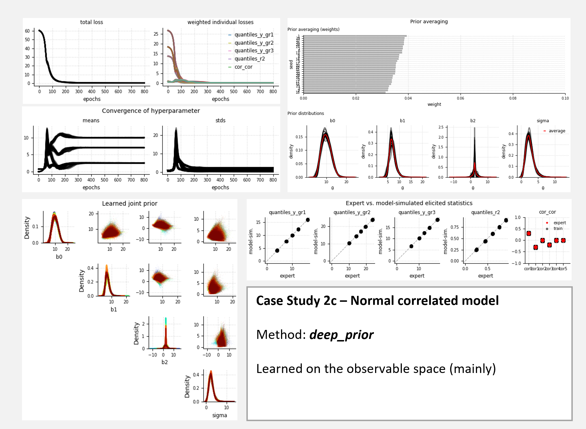
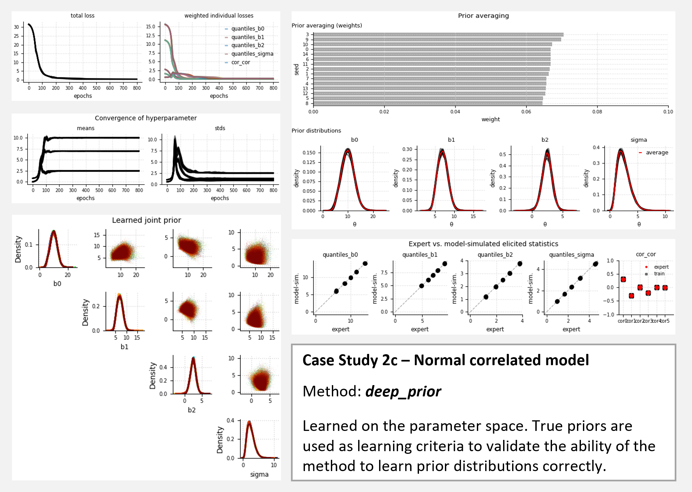

# Supplementary material for the correlated normal model (Case Study 2c)

## Content
Show method performance for three different cases:
+ Case 1: `deep_prior` method; training on (mainly) observable variables (prior predictive distribution)
+ Case 2: `deep_prior` method; training on the parameter space (validity check)

Note: Comparison with the `parametric_prior` method is not yet possible as `elicito` does not yet support
optimization of covariance matrices.

## Model
Normal model with one categorical, three-level predictor

$$
\begin{align*}
    \begin{split}
        y_i &\sim \text{Normal}(\mu_i, \sigma)\\
        \mu_i &= \beta_0+\beta_1 x_{1,i}+\beta_2 x_{2,i}\\
        \beta_0, \beta_1,\beta_2, \sigma &\sim p_\lambda(\beta_0, \beta_1, \beta_2, \sigma) \\
        \theta &\equiv (\beta_0,\beta_1,\beta_2,\sigma) 
    \end{split}
\end{align*}
$$

For `deep_prior` method, we assume a non-parametric joint prior that is learned via normalizing flows.

## Target quantities and elicited statistics
**Target quantities**
+ prior predictive observations conditional on the three groups, $y \mid \text{gr}_i$ for $i=1,2,3$
+ variance explained $R^2=\frac{Var(\mu_i)}{Var(y_i)}$ 

if `deep_prior` method is used additionally:
+ correlation between model parameters $\rho_{ij}(\theta_i,\theta_j)$ for $i,j =1,\ldots,4$, $i\neq j$ 

**Elicited statistics**
+ quantile-based elicitation for each $y \mid \text{gr}_i$
+ quantile-based elicitation for $R^2$

if `deep_prior` method is used:
+ moment-based elicitation for $\rho_{ij}$

If quantile-based elicitation is used, the following five quantiles are elicited: $5\%,25\%,50\%,75\%,95\%$.
In moment-based elicitation, we consider the *mean*.

## Expert data
Expert data are retrieved by simulating once from a pre-specified
ground truth, whereby we assume the following independent prior distributions:

$$
\begin{align*}
\beta &\sim \text{Mv-Normal}\left(
    \begin{bmatrix}  10 \\\\ 7 \\\ 2.5\end{bmatrix}, 
    \text{D}(s) \, \textbf{R} \, \text{D}(s)
    \right) \text{ with} \\
\\
      \textbf{R} &= \begin{bmatrix} 
        1. & 0.3 & -0.3 \\\ 0.3 & 1. & -0.2 \\\ -0.3 & -0.2 & 1. 
        \end{bmatrix} \text{ and } s = ( 2.5 , 1.3 , 0.8 )\\
\\
    \sigma &\sim \text{Gamma}(5, 2)
\end{align*}
$$

## Learning criterion (Loss)
### For case 1:
We weight the $R^2$ loss component by a factor of $10$ as it acts on a smaller scale than $y_{gr_i}$.
Furthermore, we weight the correlations $\rho_{ij}$ by a factor of $0.1$ as the L2 loss yields larger loss values
than the $\text{MMD}^2$ loss.

$$
\begin{align*}
\mathcal{L}(\lambda) =& 1.0\cdot\text{MMD}^2_b(\{Q_p(y_{gr_1})\}_p, \{Q_p(\hat{y}_{gr_1})\}_p)+
1.0\cdot\text{MMD}^2_b(\{Q_p(y_{gr_2})\}_p, \{Q_p(\hat{y}_{gr_2})\}_p)\\
+& 1.0\cdot\text{MMD}^2_b(\{Q_p(y_{gr_3})\}_p, \{Q_p(\hat{y}_{gr_3})\}_p)+10.0\cdot\text{MMD}^2_b(\{Q_p(R^2)\}_p, \{Q_p(\hat{R}^2)\}_p)\\
+& 0.1\cdot\text{L2}(\{\rho_{ij}(\lambda)\}_{ij}, \{\hat{\rho}_{ij}(\lambda)\}_{ij})
\end{align*}
$$

\text{if deep_prior}& \text{ method is used: }\\
### For case 2 (validity check):
All loss components are equally weighted ($w=1.0$). $\hat{\theta}$ are retrieved from a prespecified ground truth.

$$
\begin{align*}
\mathcal{L}(\lambda) = &\text{MMD}^2_b(\{Q_p(\beta_0)\}_p, \{Q_p(\hat{\beta}_0)\}_p)+
\text{MMD}^2_b(\{Q_p(\beta_1)\}_p, \{Q_p(\hat{\beta}_1)\}_p)\\
+&\text{MMD}^2_b(\{Q_p(\beta_2)\}_p, \{Q_p(\hat{\beta}_2)\}_p)+\text{MMD}^2_b(\{Q_p(\sigma)\}_p, \{Q_p(\hat{\sigma})\}_p)
\end{align*}
$$

## Fitting the model
Optimization via mini-batch SGD with Adam optimizer and... 
+ initial learning rate $lr_0=0.00025$
+ batch size $B=128$
+ samples from prior $S=200$
+ number of epochs $E=800$

## Results 
### Case 1

### Case 2
